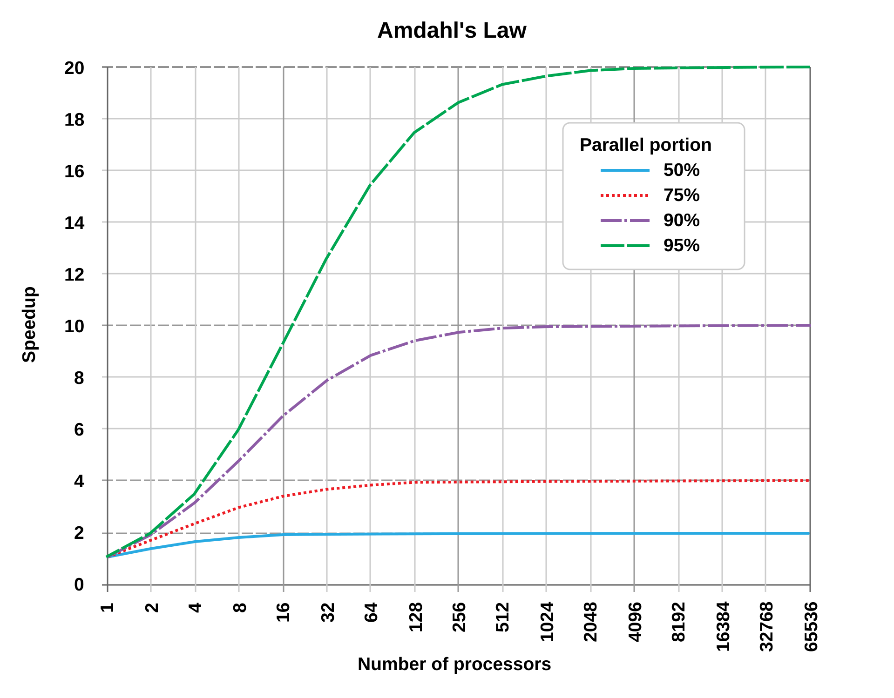

<!--  -->

# Workshop na paralelní programování

## Úvod

Tento workshop je zaměřen na paralelní programování v C.
Budeme se zabývat různými technikami a knihovnami,
které nám umožňují efektivně využívat více jader procesoru pro zrychlení výpočtů.

## Obsah

1. [Úvod do paralelního programování](#úvod-do-paralelního-programování)
2. [POSIX](#posix)
3. [OpenMP](#openmp)
4. [MPI](#mpi)

## Úvod do paralelního programování

Paralelní programování je technika, která nám umožňuje rozdělit úlohu na menší části,
které mohou být vykonávány současně na více procesorech nebo jádrech.

Tímto způsobem můžeme dosáhnout výrazného zrychlení výpočtů,
zejména u úloh, které jsou náročné na výpočetní výkon.

Parallelizace a maximální zrychlení lze odhadnout pomocí [Amdahlova zákona](https://en.wikipedia.org/wiki/Amdahl%27s_law),
který říká, že maximální zrychlení je omezeno podílem sekvenční části úlohy.

Výpočet maximálního zrychlení je dán vzorcem:

$$
S = \frac{1}{(1 - P) + \frac{P}{N}}
$$
kde:
- $S$ je maximální zrychlení
- $P$ je podíl paralelizovatelné části úlohy
- $N$ je počet procesorů
- $(1 - P)$ je podíl sekvenční části úlohy
- $\frac{P}{N}$ je podíl paralelizovatelné části úlohy, která je rozdělena mezi $N$ procesorů
- $1$ je celkový čas potřebný k vykonání úlohy na jednom procesoru

Pro příklad, předpokládejme, že máme úlohu, ve které můžeme 90% výpočtů paralelizovat.
Pokud použijeme 4 procesory, maximální zrychlení bude:

$$
S = \frac{1}{(1 - 0.9) + \frac{0.9}{4}} = \frac{1}{0.1 + 0.225} = \frac{1}{0.325} \approx 3.08
$$

To znamená, že maximální zrychlení této úlohy na 4 procesorech je přibližně 3.08x.

Pokud bychom použili 32 procesorů, maximální zrychlení by bylo:

$$
S = \frac{1}{(1 - 0.9) + \frac{0.9}{32}} = \frac{1}{0.1 + 0.028125} = \frac{1}{0.128125} \approx 7.8
$$

To znamená, že maximální zrychlení této úlohy na 32 procesorech je přibližně 7.8x.

Pokud bychom použili 128 procesorů, maximální zrychlení by bylo:

$$
S = \frac{1}{(1 - 0.9) + \frac{0.9}{128}} = \frac{1}{0.1 + 0.00703125} = \frac{1}{0.10703125} \approx 9.34
$$

To znamená, že maximální zrychlení této úlohy na 128 procesorech je přibližně 9.34x.


Zdroj: [Wikipedia](https://en.wikipedia.org/wiki/Amdahl%27s_law)

## POSIX

POSIX (Portable Operating System Interface) je standard pro operační systémy,
který definuje rozhraní pro systémové volání a knihovny.

POSIX zahrnuje také rozhraní pro vlákna (threads),
které nám umožňuje vytvářet a spravovat vlákna v našem programu.

Sekvenční kód pro výpočty Fibonacciho čísel najdete v souboru [fibonacci.c](./code/01_fibonacci/fibonacci.c).

Paralelní verzi pomocí POSIX vláken najdete v souboru [fibonacci_pthread.c](./code/01_fibonacci/fibonacci_pthread.c).

## Mutexy

Mutexy (mutual exclusion) jsou synchronizační primitiva,
která nám umožňují zajistit vzájemné vyloučení při přístupu k sdíleným prostředkům.

Mutexy nám umožňují zajistit, že pouze jedno vlákno může přistupovat k určitému prostředku v daném okamžiku.

To znamená, že pokud jedno vlákno drží mutex,
další vlákna, která se pokoušejí získat tento mutex, budou blokována,

Blokování (blocking) znamená, že vlákno čeká na uvolnění mutexu,
až bude uvolněn jiným vláknem.

Čekání je řízeno systémem,
a vlákno bude probuzeno, jakmile bude mutex uvolněn.

Naivní implementace paralelního sčítání najdete v souboru [counter_naive.c](code/02_counter/counter_naive.c)

Správným použitím mutexů můžeme zajistit,
že pouze jedno vlákno může přistupovat k sdílenému prostředku v daném okamžiku.

Opravený kód najdete v souboru [counter_fixed.c](code/02_counter/counter_fixed.c)

## Uváznutí (Deadlock)

Uváznutí (deadlock) je situace, kdy dvě nebo více vláken čekají na vzájemné uvolnění mutexů,
a tím pádem se nikdy neprobudí.

Uváznutí může nastat, pokud vlákno A drží mutex M1 a čeká na mutex M2,
a vlákno B drží mutex M2 a čeká na mutex M1.

Tímto způsobem se obě vlákna navzájem blokují a nikdy se neprobudí.

Příklad uváznutí najdete v souboru [bank.c](code/03_bank/bank.c)

## Condition variables

Podmínkové proměnné (condition variables) jsou synchronizační primitiva,
která nám umožňují synchronizovat vlákna na základě určité podmínky.

Podmínkové proměnné se používají ve spojení s mutexy (vzájemným vyloučením),
abychom zajistili, že vlákno čeká na určitou podmínku

Ukázku použití podmínkových proměnných najdete v souboru [conditional_variable.c](code/05_conditional_variable/conditional_variable.c)

## OpenMP

OpenMP (Open Multi-Processing) je rozhraní pro paralelní programování,
které je založeno na direktivách a pragmatech.

Nainstalujte OpenMP pomocí:

```bash
sudo apt install libomp-dev
```

A použijte příkaz `gcc` pro kompilaci s OpenMP:

```bash
gcc -fopenmp -o code code.c
```

Ukázku použití OpenMP najdete v souboru [fibonacci_openmp.c](code/06_fibonacci_openmp/fibonacci_openmp.c)

## Samostatný úkol

Napište program, který paralelizuje výpočet násobení dvou matic pomocí POSIX vláken.

Základní sekventní kód pro násobení dvou matic najdete v souboru [matrix.c](./code/09_matrix/matrix.c).

Implementuje nejdříve paralelní verzi pomocí POSIX vláken a následně pomocí OpenMP.

## MPI

MPI (Message Passing Interface) je standard pro paralelní programování,
který je určen pro distribuované systémy.

MPI nám umožňuje komunikovat mezi procesy,
které běží na různých uzlech v clusteru nebo superpočítači.

MPI je velmi výkonný a flexibilní nástroj pro paralelní programování,
ale je také složitější než OpenMP nebo POSIX.

<!--  -->
