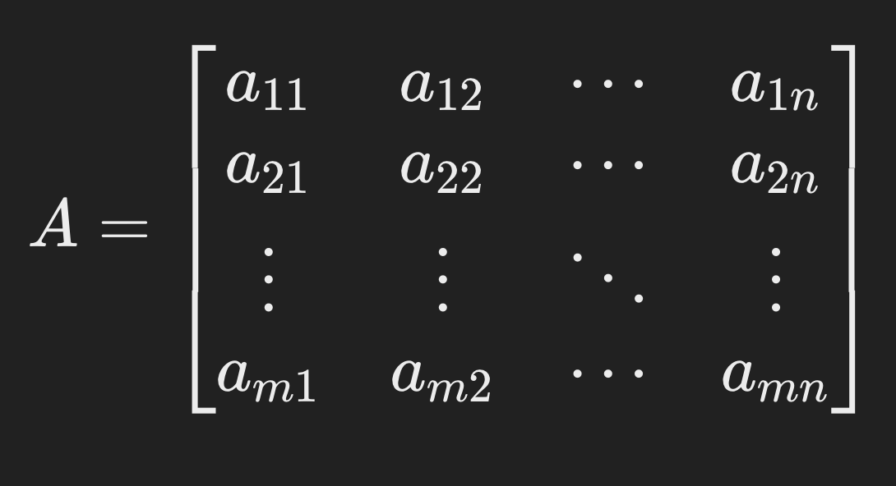
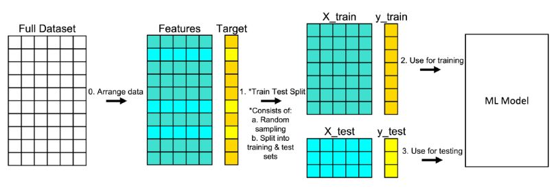
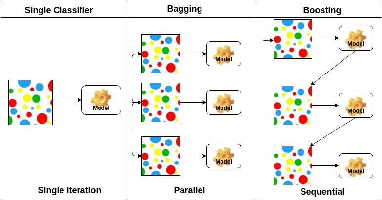

<!--  -->

# Práce s daty

## Úvod

Workshop je zaměřen na praktickou práci s daty v jazyce Python.
Projdeme si základy efektivního ukládání dat pomocí řídkých matic
a následně si na reálném datasetu z katastrofy lodi Titanic vyzkoušíme
celý pipeline datové analýzy a strojového učení — od průzkumové analýzy dat (EDA),
přes předzpracování, až po trénování klasifikačních modelů.

Notebooky pro lektora:

- [Základy notebooku](notebooks/zaklady_notebooku.ipynb) — úvod do Jupyteru a Pythonu
- [Titanic](notebooks/titanic.ipynb) — EDA, předzpracování, klasifikační modely
- [Řídké matice](notebooks/ridke_matice.ipynb) — COO, CSR, CSC formáty a porovnání paměti

Hlavní knihovny, které budeme používat:

- [NumPy](https://numpy.org/) — práce s maticemi a numerickými výpočty
- [SciPy](https://scipy.org/) — vědecké výpočty, řídké matice
- [pandas](https://pandas.pydata.org/) — práce s tabulkovými daty
- [matplotlib](https://matplotlib.org/) — vizualizace dat
- [seaborn](https://seaborn.pydata.org/) — statistická vizualizace
- [scikit-learn](https://scikit-learn.org/) — strojové učení
- [PyTorch](https://pytorch.org/) — neuronové sítě

Klíčové pojmy:

- **DataFrame** — tabulková datová struktura v knihovně pandas (řádky a sloupce)
- **Hustá matice (Dense matrix)** — matice, kde jsou uloženy všechny prvky včetně nul
- **Řídká matice (Sparse matrix)** — matice, kde je většina prvků nulových a ukládají se pouze nenulové prvky
- **Exploratory Data Analysis (EDA)** — průzkumová analýza dat, vizuální a statistické zkoumání datasetu
- **Strojové učení (Machine Learning)** — automatické učení modelů z dat
- **Klasifikace** — úloha predikce diskrétní kategorie (např. přežil / nepřežil)

> K čemu je dobrá průzkumová analýza dat (EDA)?

<details>
<summary>Odpověď</summary>

EDA nám pomáhá pochopit strukturu dat, odhalit chybějící hodnoty, identifikovat vzory a vztahy mezi proměnnými
a vybrat vhodné přístupy pro předzpracování a modelování. Bez EDA bychom mohli přehlédnout důležité vlastnosti
datasetu a postavit model na špatných předpokladech.

</details>

> Jaký je rozdíl mezi klasifikací a regresí ve strojovém učení?

<details>
<summary>Odpověď</summary>

Klasifikace predikuje diskrétní kategorii (např. přežil/nepřežil, spam/ne-spam),
zatímco regrese predikuje spojitou hodnotu (např. cenu domu, teplotu).

</details>

## Příprava playgroundu

Nastartujte si nový `docker` workspace přes Coder.

Vytvořte si nový adresář pro tento workshop

```shell
mkdir ~/prace-s-daty-workshop
cd ~/prace-s-daty-workshop
```

Zkopírujte si datové soubory z repozitáře workshopu

```shell
mkdir -p data
cp /cesta/k/repozitari/lectures/workshopy/prace-s-daty/data/train.csv data/
cp /cesta/k/repozitari/lectures/workshopy/prace-s-daty/data/test.csv data/
```

> **Poznámka**: Data pocházejí ze soutěže [Kaggle Titanic](https://www.kaggle.com/c/titanic/data)
> a lze je stáhnout i přímo z Kaggle.

Spusťte JupyterLab pomocí Dockeru

```shell
docker run -it --rm \
  -p 8888:8888 \
  -v $(pwd):/home/jovyan/work \
  quay.io/jupyter/datascience-notebook:2026-04-13
```

Po spuštění kontejneru se v terminálu zobrazí URL s tokenem.
Otevřete toto URL v prohlížeči a v JupyterLab přejděte do složky `work/`.

Vytvořte nový notebook (Python 3) a ověřte, že prostředí funguje

```python
import numpy as np
import pandas as pd
import matplotlib.pyplot as plt

print("Vše funguje!")
```

Později budeme potřebovat PyTorch — nainstalujte ho přímo v notebooku

```python
!pip install torch
```

> **Poznámka**: Instalace PyTorch může trvat několik minut. Knihovnu budeme potřebovat až v sekci neuronových sítí,
> takže instalaci můžete spustit na pozadí a pokračovat ve workshopu.

## Řídké matice

### Husté matice (Dense matrices)

Hustá matice je dvourozměrné pole, kde jsou v paměti uloženy **všechny prvky** včetně nul.
To znamená, že hustá matice může být jednodušší na práci, protože nemusíme řešit vzor řídkosti,
ale pro velké matice s mnoha nulami je to plýtvání pamětí.

Matematicky lze hustou matici A o rozměrech m × n zapsat jako:



Husté matice jsou běžně používány v lineární algebře, statistice, strojovém učení
a numerické analýze.

Vytvoření husté matice v NumPy

```python
import numpy as np

matrix = np.array([[1, 0, 2, 0, 3],
                   [0, 0, 4, 0, 0],
                   [5, 0, 6, 0, 7],
                   [0, 0, 8, 0, 0],
                   [9, 0, 10, 0, 11]])
```

> Kolik procent prvků v této matici je nulových?

<details>
<summary>Odpověď</summary>

Z 25 prvků je 14 nulových, tedy 56 % prvků je nulových.

</details>

### Řídké matice (Sparse matrices)

Řídké matice jsou specializovaná datová struktura pro matice, kde je **většina prvků nulových**.
Na rozdíl od hustých matic ukládají pouze nenulové prvky spolu s jejich indexy.
To může výrazně snížit paměťové nároky a zrychlit výpočty.

Řídké matice se běžně vyskytují ve vědeckých výpočtech, strojovém učení a teorii grafů,
kde matice reprezentují vztahy, sítě nebo vysokodimenzionální data.

Existují různé reprezentace řídkých matic, z nichž nejběžnější jsou:

1. **COO (Coordinate List)** — ukládá nenulové prvky spolu s jejich řádkovými a sloupcovými indexy
2. **CSR (Compressed Sparse Row)** — optimalizováno pro řádkové operace
3. **CSC (Compressed Sparse Column)** — optimalizováno pro sloupcové operace

Výběr vhodné reprezentace závisí na velikosti matice, vzoru řídkosti
a typech operací, které s maticí budeme provádět.

### Formát COO (Coordinate List)

Formát COO ukládá tři pole:
- `data` — hodnoty nenulových prvků
- `row` — řádkové indexy
- `col` — sloupcové indexy

```python
from scipy.sparse import coo_matrix

matrix = np.array([[1, 0, 2, 0, 3],
                   [0, 0, 4, 0, 0],
                   [5, 0, 6, 0, 7],
                   [0, 0, 8, 0, 0],
                   [9, 0, 10, 0, 11]])

matrix_coo = coo_matrix(matrix)
matrix_coo.data, matrix_coo.row, matrix_coo.col
```

Výstup:

```
(array([ 1,  2,  3,  4,  5,  6,  7,  8,  9, 10, 11]),
 array([0, 0, 0, 1, 2, 2, 2, 3, 4, 4, 4]),
 array([0, 2, 4, 2, 0, 2, 4, 2, 0, 2, 4]))
```

Každý nenulový prvek je reprezentován trojicí `(row, col, data)`.
Např. prvek s hodnotou `4` se nachází na řádku `1`, sloupci `2`.

### Formát CSR (Compressed Sparse Row)

Formát CSR ukládá tři pole:
- `data` — hodnoty nenulových prvků
- `indices` — sloupcové indexy nenulových prvků
- `indptr` — ukazatele na začátek každého řádku v poli `data`

```python
from scipy.sparse import csr_matrix

matrix_csr = csr_matrix(matrix)
matrix_csr.data, matrix_csr.indices, matrix_csr.indptr
```

Výstup:

```
(array([ 1,  2,  3,  4,  5,  6,  7,  8,  9, 10, 11]),
 array([0, 2, 4, 2, 0, 2, 4, 2, 0, 2, 4]),
 array([ 0,  3,  4,  7,  8, 11]))
```

Pole `indptr` má délku `počet_řádků + 1`.
Nenulové prvky řádku `i` najdeme v `data[indptr[i]:indptr[i+1]]`.

Např. pro řádek 0: `data[0:3]` = `[1, 2, 3]` na sloupcích `indices[0:3]` = `[0, 2, 4]`.

### Formát CSC (Compressed Sparse Column)

Formát CSC je analogický k CSR, ale komprimuje sloupcové informace místo řádkových.
Je optimalizován pro sloupcové operace.

```python
from scipy.sparse import csc_matrix

matrix_csc = csc_matrix(matrix)
matrix_csc.data, matrix_csc.indices, matrix_csc.indptr
```

Výstup:

```
(array([ 1,  5,  9,  2,  4,  6,  8, 10,  3,  7, 11]),
 array([0, 2, 4, 0, 1, 2, 3, 4, 0, 2, 4]),
 array([ 0,  3,  3,  8,  8, 11]))
```

Zde `indptr` ukazuje na začátek každého sloupce.
Sloupec 0 obsahuje `data[0:3]` = `[1, 5, 9]` na řádcích `indices[0:3]` = `[0, 2, 4]`.

> Všimněte si, že sloupce 1 a 3 jsou prázdné — `indptr[1] == indptr[2]` a `indptr[3] == indptr[4]`.

### Porovnání paměťové náročnosti

Vytvořme velkou matici 10 000 × 10 000 s přibližně 90 % nulových prvků a porovnejme paměťovou náročnost

```python
# Vytvoření husté matice 10 000 × 10 000
dense_matrix = np.random.rand(10_000, 10_000)

# Nastavení 90 % prvků na nulu
dense_matrix[dense_matrix < 0.9] = 0
```

Ověření řídkosti

```python
# Podíl nenulových prvků
print(f"Podíl nenulových prvků: {(dense_matrix > 0).mean():.4f}")
print(f"Počet nulových prvků: {(dense_matrix == 0).sum()}")
```

Porovnání paměti

```python
from scipy.sparse import coo_matrix, csr_matrix, csc_matrix

def get_coo_matrix_size(sparse_matrix):
    size_of_data = sparse_matrix.data.nbytes
    size_of_rows = sparse_matrix.row.nbytes
    size_of_cols = sparse_matrix.col.nbytes
    return size_of_data + size_of_rows + size_of_cols

def get_csrcsc_matrix_size(sparse_matrix):
    size_of_data = sparse_matrix.data.nbytes
    size_of_indices = sparse_matrix.indices.nbytes
    size_of_indptr = sparse_matrix.indptr.nbytes
    return size_of_data + size_of_indices + size_of_indptr

dense_matrix_coo = coo_matrix(dense_matrix)
dense_matrix_csr = csr_matrix(dense_matrix)
dense_matrix_csc = csc_matrix(dense_matrix)

print(f"Hustá matice: {dense_matrix.nbytes / 1e6:.1f} MB")
print(f"COO formát:   {get_coo_matrix_size(dense_matrix_coo) / 1e6:.1f} MB")
print(f"CSR formát:   {get_csrcsc_matrix_size(dense_matrix_csr) / 1e6:.1f} MB")
print(f"CSC formát:   {get_csrcsc_matrix_size(dense_matrix_csc) / 1e6:.1f} MB")
```

Očekávaný výstup (přibližně):

```
Hustá matice: 800.0 MB
COO formát:   160.0 MB
CSR formát:   120.0 MB
CSC formát:   120.0 MB
```

> Proč formát COO zabírá více paměti než CSR a CSC?

<details>
<summary>Odpověď</summary>

Formát COO ukládá pro každý nenulový prvek zvlášť řádkový i sloupcový index,
což vyžaduje dvě pole indexů o délce počtu nenulových prvků.

Formáty CSR a CSC komprimují jednu dimenzi pomocí pole `indptr`,
které má délku pouze `počet_řádků + 1` (resp. `počet_sloupců + 1`),
což je výrazně méně než počet nenulových prvků.

</details>

### Samostatná úloha 1

Vytvořte jednotkovou matici 1 000 × 1 000 (matice, kde jsou jedničky pouze na diagonále).

1. Vytvořte ji pomocí `np.eye(1000)`
2. Převeďte ji do všech tří řídkých formátů (COO, CSR, CSC)
3. Porovnejte paměťovou náročnost všech čtyř reprezentací
4. Který formát je pro jednotkovou matici nejefektivnější a proč?

<details>
<summary>Řešení</summary>

```python
import numpy as np
from scipy.sparse import coo_matrix, csr_matrix, csc_matrix

# Jednotková matice 1000 × 1000
identity = np.eye(1000)

# Převod do řídkých formátů
identity_coo = coo_matrix(identity)
identity_csr = csr_matrix(identity)
identity_csc = csc_matrix(identity)

# Porovnání paměti
print(f"Hustá matice: {identity.nbytes / 1e6:.1f} MB")
print(f"COO formát:   {get_coo_matrix_size(identity_coo) / 1e6:.3f} MB")
print(f"CSR formát:   {get_csrcsc_matrix_size(identity_csr) / 1e6:.3f} MB")
print(f"CSC formát:   {get_csrcsc_matrix_size(identity_csc) / 1e6:.3f} MB")
```

Výstup:

```
Hustá matice: 8.0 MB
COO formát:   0.024 MB
CSR formát:   0.016 MB
CSC formát:   0.016 MB
```

CSR a CSC jsou stejně efektivní, protože jednotková matice má přesně jeden nenulový prvek
na každém řádku i sloupci. Obě reprezentace tak mají identickou strukturu.
COO je méně efektivní, protože ukládá oba indexy (řádkový i sloupcový) pro každý prvek.

</details>

### Samostatná úloha 2

Experimentujte s různými stupni řídkosti matice 5 000 × 5 000.

1. Vytvořte náhodnou matici a postupně nastavte různé procento prvků na nulu: 50 %, 80 %, 95 %, 99 %
2. Pro každý stupeň řídkosti změřte paměťovou náročnost husté matice a formátu CSR
3. Výsledky vykreslete do grafu pomocí matplotlib
4. Při jakém stupni řídkosti se CSR stane efektivnějším než hustá matice?

<details>
<summary>Řešení</summary>

```python
import numpy as np
import matplotlib.pyplot as plt
from scipy.sparse import csr_matrix

sparsity_levels = [0.5, 0.8, 0.95, 0.99]
dense_sizes = []
csr_sizes = []

for sparsity in sparsity_levels:
    matrix = np.random.rand(5000, 5000)
    matrix[matrix < sparsity] = 0

    csr = csr_matrix(matrix)

    dense_sizes.append(matrix.nbytes / 1e6)
    csr_sizes.append(
        (csr.data.nbytes + csr.indices.nbytes + csr.indptr.nbytes) / 1e6
    )

labels = [f"{int(s * 100)} %" for s in sparsity_levels]

plt.figure(figsize=(10, 6))
plt.bar([x - 0.2 for x in range(len(labels))], dense_sizes, 0.4, label="Hustá matice")
plt.bar([x + 0.2 for x in range(len(labels))], csr_sizes, 0.4, label="CSR formát")
plt.xticks(range(len(labels)), labels)
plt.xlabel("Podíl nulových prvků")
plt.ylabel("Paměť (MB)")
plt.title("Porovnání paměťové náročnosti podle řídkosti")
plt.legend()
plt.show()
```

CSR je efektivnější než hustá matice přibližně od 75–80 % řídkosti.
Přesný bod závisí na datovém typu a velikosti matice.

</details>

## Titanic: Průzkumová analýza dat (EDA)

V této části budeme pracovat s datasetem z katastrofy lodi [Titanic](https://www.kaggle.com/c/titanic).
Cílem je na základě informací o pasažérech predikovat, zda přežili nebo nepřežili.

### Načtení dat

```python
import pandas as pd
import seaborn as sns
import matplotlib.pyplot as plt

train = pd.read_csv('data/train.csv')
train
```

Zobrazení základních informací o datasetu

```python
print(f"Počet řádků: {train.shape[0]}")
print(f"Počet sloupců: {train.shape[1]}")
train.info()
```

Popis sloupců:

| Sloupec | Popis |
|---------|-------|
| **PassengerId** | Unikátní ID pasažéra |
| **Survived** | 0 = Nepřežil, 1 = Přežil |
| **Pclass** | Třída cestovního lístku (1 = 1., 2 = 2., 3 = 3.) |
| **Name** | Jméno pasažéra |
| **Sex** | Pohlaví (male, female) |
| **Age** | Věk v letech |
| **SibSp** | Počet sourozenců / manželů/manželek na palubě |
| **Parch** | Počet rodičů / dětí na palubě |
| **Ticket** | Číslo lístku |
| **Fare** | Cena jízdenky |
| **Cabin** | Číslo kajuty |
| **Embarked** | Přístav nalodění (C = Cherbourg, Q = Queenstown, S = Southampton) |

Zdroj: [Kaggle](https://www.kaggle.com/c/titanic/data)

### Vizualizace

#### Distribuce cílové proměnné

```python
train['Survived'].value_counts().plot(kind='bar')
plt.title('Distribuce přežití')
plt.xlabel('Přežil (0 = Ne, 1 = Ano)')
plt.ylabel('Počet')
plt.show()
```

Totéž pomocí seaborn

```python
sns.countplot(x='Survived', data=train)
plt.title('Distribuce přežití')
plt.show()
```

#### Přežití podle třídy

```python
train.groupby('Pclass')['Survived'].mean().plot(kind='bar')
plt.title('Míra přežití podle třídy')
plt.xlabel('Třída')
plt.ylabel('Míra přežití')
plt.show()
```

```python
sns.barplot(x='Pclass', y='Survived', data=train)
plt.title('Míra přežití podle třídy')
plt.show()
```

#### Přežití podle pohlaví

```python
train.groupby('Sex')['Survived'].mean().plot(kind='bar')
plt.title('Míra přežití podle pohlaví')
plt.xlabel('Pohlaví')
plt.ylabel('Míra přežití')
plt.show()
```

#### Distribuce věku podle přežití

```python
train[train['Survived'] == 0]['Age'].hist(bins=30, alpha=0.5, color='red', label='Nepřežil')
train[train['Survived'] == 1]['Age'].hist(bins=30, alpha=0.5, color='blue', label='Přežil')
plt.title('Distribuce věku podle přežití')
plt.xlabel('Věk')
plt.ylabel('Počet')
plt.legend()
plt.show()
```

#### Přežití podle počtu sourozenců/partnerů

```python
train.groupby('SibSp')['Survived'].mean().plot(kind='bar')
plt.title('Míra přežití podle počtu sourozenců/partnerů')
plt.xlabel('SibSp')
plt.ylabel('Míra přežití')
plt.show()
```

#### Přežití podle počtu rodičů/dětí

```python
train.groupby('Parch')['Survived'].mean().plot(kind='bar')
plt.title('Míra přežití podle počtu rodičů/dětí')
plt.xlabel('Parch')
plt.ylabel('Míra přežití')
plt.show()
```

#### Distribuce ceny jízdenky podle přežití

```python
train[train['Survived'] == 0]['Fare'].hist(bins=30, alpha=0.5, color='red', label='Nepřežil')
train[train['Survived'] == 1]['Fare'].hist(bins=30, alpha=0.5, color='blue', label='Přežil')
plt.title('Distribuce ceny jízdenky podle přežití')
plt.xlabel('Cena')
plt.ylabel('Počet')
plt.legend()
plt.show()
```

#### Kajuta a přežití

```python
print(f"Počet chybějících hodnot v Cabin: {train['Cabin'].isna().sum()}")

train[train['Survived'] == 1]['Cabin'].str[0].fillna('Neznámá').value_counts().plot(kind='bar')
plt.title('Přežití podle kajuty (první písmeno)')
plt.xlabel('Kajuta')
plt.ylabel('Počet přeživších')
plt.show()
```

#### Přežití podle přístavu nalodění

```python
train.groupby('Embarked')['Survived'].mean().plot(kind='bar')
plt.title('Míra přežití podle přístavu nalodění')
plt.xlabel('Přístav')
plt.ylabel('Míra přežití')
plt.show()
```

> Která proměnná má podle vizualizací nejsilnější vliv na přežití?

<details>
<summary>Odpověď</summary>

Pohlaví (Sex) — ženy přežily výrazně častěji než muži.
Dále pak třída cestovního lístku (Pclass) — pasažéři 1. třídy přežili častěji než pasažéři 3. třídy.

</details>

### Samostatná úloha 3

1. Vytvořte korelační matici numerických sloupců (`Survived`, `Pclass`, `Age`, `SibSp`, `Parch`, `Fare`)
   a vizualizujte ji pomocí `sns.heatmap`
2. Které dvě číselné proměnné nejvíce korelují s přežitím?
3. Vytvořte seskupený sloupcový graf míry přežití podle kombinace třídy (Pclass) a pohlaví (Sex)
   pomocí `sns.barplot` s parametrem `hue`

<details>
<summary>Řešení</summary>

```python
import seaborn as sns
import matplotlib.pyplot as plt

# Korelační matice
corr = train[['Survived', 'Pclass', 'Age', 'SibSp', 'Parch', 'Fare']].corr()
plt.figure(figsize=(8, 6))
sns.heatmap(corr, annot=True, cmap='coolwarm', center=0)
plt.title('Korelační matice')
plt.show()

# Seskupený barplot
sns.barplot(x='Pclass', y='Survived', hue='Sex', data=train)
plt.title('Míra přežití podle třídy a pohlaví')
plt.show()
```

Nejvíce korelující proměnné s přežitím jsou `Fare` (pozitivní korelace — dražší lístek → vyšší šance)
a `Pclass` (negativní korelace — nižší třída → nižší šance na přežití).

</details>

## Titanic: Předzpracování dat

Než začneme trénovat modely, musíme data připravit — odstranit nepotřebné sloupce,
zpracovat chybějící hodnoty a zakódovat kategorické proměnné.

### Rozdělení na trénovací a testovací data

V strojovém učení rozdělujeme data na dvě části:
- **Trénovací data (train)** — na těchto datech model trénujeme, známe správné odpovědi
- **Testovací data (test)** — na těchto datech model vyhodnocujeme, neznáme správné odpovědi



Zdroj: [builtin.com](https://builtin.com/data-science/train-test-split)

V našem případě máme trénovací data (`train.csv` — 891 pasažérů se známým přežitím)
a testovací data (`test.csv` — 418 pasažérů, přežití neznáme).

```python
train = pd.read_csv('data/train.csv')
test = pd.read_csv('data/test.csv')

print(f"Trénovací data: {len(train)} řádků")
print(f"Testovací data: {len(test)} řádků")
```

### Odstranění nepotřebných sloupců

Některé sloupce nenesou užitečnou informaci pro predikci

```python
# Z trénovacích dat odstraníme PassengerId, Name, Ticket, Cabin
train = train.drop(columns=['PassengerId', 'Name', 'Ticket', 'Cabin'])

# Z testovacích dat ponecháme PassengerId (potřebujeme ho pro submission)
test = test.drop(columns=['Name', 'Ticket', 'Cabin'])

train
```

### Zpracování chybějících hodnot

Zjistíme, které sloupce mají chybějící hodnoty

```python
print("Trénovací data:")
print(train.isnull().sum())
print()
print("Testovací data:")
print(test.isnull().sum())
```

Sloupce `Age` a `Embarked` mají chybějící hodnoty v trénovacích datech.
V testovacích datech chybí navíc hodnoty ve sloupci `Fare`.

Chybějící hodnoty můžeme:
- **odstranit** — smazat řádky s chybějícími hodnotami
- **doplnit** — nahradit průměrem (mean), mediánem (median) nebo nejčastější hodnotou (mode)

```python
# Doplnění chybějících hodnot v trénovacích datech
train['Age'] = train['Age'].fillna(train['Age'].mean())
train['Embarked'] = train['Embarked'].fillna(train['Embarked'].mode()[0])

# Doplnění chybějících hodnot v testovacích datech
test['Age'] = test['Age'].fillna(test['Age'].mean())
test['Fare'] = test['Fare'].fillna(test['Fare'].mean())
```

Ověření

```python
print("Trénovací data — chybějící hodnoty:")
print(train.isnull().sum())
print()
print("Testovací data — chybějící hodnoty:")
print(test.isnull().sum())
```

### Kódování kategorických proměnných

Modely strojového učení vyžadují numerický vstup.
Kategorické sloupce (typ `object`) musíme převést na čísla.

```python
# Které sloupce jsou kategorické?
train.dtypes
```

Použijeme **one-hot encoding** — pro každou kategorii vytvoříme nový binární sloupec

```python
train = pd.get_dummies(train, columns=["Sex", "Embarked"])
test = pd.get_dummies(test, columns=["Sex", "Embarked"])

train
```

> Jaký je rozdíl mezi one-hot encoding a label encoding?

<details>
<summary>Odpověď</summary>

**One-hot encoding** vytváří pro každou kategorii nový binární sloupec (0/1).
Nezavádí žádné uspořádání mezi kategoriemi.
Např. `Sex` → `Sex_female` (0/1) + `Sex_male` (0/1).

**Label encoding** přiřazuje každé kategorii celé číslo (0, 1, 2...).
Tím implicitně zavádí pořadí, které u nominálních proměnných nedává smysl.
Např. `Embarked` → C=0, Q=1, S=2 (ale Q není „mezi" C a S).

Pro nominální proměnné je vhodnější one-hot encoding.

</details>

### Samostatná úloha 4

Místo doplnění chybějícího věku průměrem vyzkoušejte jiné strategie:

1. Doplňte mediánem celého sloupce
2. Doplňte mediánem podle třídy (Pclass) — tj. pro každou třídu zvlášť
3. Která strategie dává větší intuitivní smysl a proč?

<details>
<summary>Řešení</summary>

```python
# Znovu načteme data
train_raw = pd.read_csv('data/train.csv')

# 1. Medián celého sloupce
age_median = train_raw['Age'].median()
print(f"Medián věku: {age_median}")

# 2. Medián podle třídy
train_raw['Age_per_class'] = train_raw.groupby('Pclass')['Age'].transform(
    lambda x: x.fillna(x.median())
)

print("\nMedián věku podle třídy:")
print(train_raw.groupby('Pclass')['Age'].median())
```

Doplnění mediánem podle třídy dává větší smysl, protože pasažéři 1. třídy
byli typicky starší než pasažéři 3. třídy. Globální průměr/medián
tento rozdíl ignoruje.

</details>

## Titanic: Klasifikační modely

Nyní máme data předzpracovaná a můžeme trénovat klasifikační modely.



Zdroj: [datacamp.com](https://www.datacamp.com/tutorial/adaboost-classifier-python)

### Příprava dat pro trénování

```python
X = train.drop(columns='Survived')
y = train['Survived']

print(f"Počet features: {X.shape[1]}")
print(f"Features: {list(X.columns)}")
```

### Náhodný klasifikátor (Random Classifier)

Jako základ (baseline) vytvoříme „model", který predikuje náhodně

```python
import numpy as np

submission_random = pd.DataFrame({
    'PassengerId': test['PassengerId'],
    'Survived': np.random.randint(0, 2, size=len(test))
})

submission_random.to_csv('results/submission_random.csv', index=False)
submission_random.head()
```

> **Poznámka**: Náhodný klasifikátor by měl dosáhnout přibližně 50% přesnosti.
> Každý rozumný model by měl být lepší.

### Rozhodovací strom (Decision Tree)

Rozhodovací strom rozděluje data na základě podmínek do větví,
dokud nedosáhne listů s finální predikcí.

```python
from sklearn.tree import DecisionTreeClassifier, plot_tree
import matplotlib.pyplot as plt

decision_tree = DecisionTreeClassifier(
    max_depth=3,
    random_state=42
)

decision_tree.fit(X, y)
```

Vizualizace rozhodovacího stromu

```python
plt.figure(figsize=(30, 15))
plot_tree(decision_tree, feature_names=X.columns, filled=True)
plt.title('Rozhodovací strom')
plt.show()
```

Predikce na testovacích datech

```python
y_pred = decision_tree.predict(test.drop(columns=['PassengerId']))

submission_decision_tree = pd.DataFrame({
    'PassengerId': test['PassengerId'],
    'Survived': y_pred
})

submission_decision_tree.to_csv('results/submission_decision_tree.csv', index=False)
submission_decision_tree.head()
```

### Náhodný les (Random Forest)

Náhodný les je **ensemble** metoda — kombinuje mnoho rozhodovacích stromů
a výslednou predikci určuje většinovým hlasováním.

```python
from sklearn.ensemble import RandomForestClassifier

random_forest = RandomForestClassifier(
    n_estimators=100,
    max_depth=3,
    random_state=42
)

random_forest.fit(X, y)

y_pred = random_forest.predict(test.drop(columns=['PassengerId']))

submission_random_forest = pd.DataFrame({
    'PassengerId': test['PassengerId'],
    'Survived': y_pred
})

submission_random_forest.to_csv('results/submission_random_forest.csv', index=False)
submission_random_forest.head()
```

### Samostatná úloha 5

Experimentujte s parametrem `max_depth` rozhodovacího stromu.

1. Natrénujte rozhodovací stromy s `max_depth` = 1, 2, 3, 5, 10, None (bez omezení)
2. Pro každý strom spočítejte přesnost pomocí 5-fold cross-validace (`sklearn.model_selection.cross_val_score`)
3. Výsledky vykreslete do grafu
4. Jaká hodnota `max_depth` dává nejlepší výsledek na cross-validaci?

<details>
<summary>Řešení</summary>

```python
from sklearn.model_selection import cross_val_score
from sklearn.tree import DecisionTreeClassifier
import matplotlib.pyplot as plt

depths = [1, 2, 3, 5, 10, None]
scores = []

for d in depths:
    dt = DecisionTreeClassifier(max_depth=d, random_state=42)
    cv_score = cross_val_score(dt, X, y, cv=5, scoring='accuracy')
    scores.append(cv_score.mean())
    print(f"max_depth={str(d):>4s}: accuracy={cv_score.mean():.4f} (+/- {cv_score.std():.4f})")

plt.figure(figsize=(8, 5))
plt.plot([str(d) for d in depths], scores, marker='o')
plt.xlabel('max_depth')
plt.ylabel('Cross-validation accuracy')
plt.title('Vliv max_depth na přesnost rozhodovacího stromu')
plt.grid(True)
plt.show()
```

Typicky nejlepší výsledek dává `max_depth` kolem 3–5.
Příliš hluboký strom (None) má tendenci k přetrénování (overfitting).

</details>

### Neuronová síť (PyTorch)

Nyní vyzkoušíme neuronovou síť pomocí knihovny PyTorch.

```python
import torch
import torch.nn as nn
import torch.optim as optim
from torch.utils.data import DataLoader, TensorDataset
```

Převod dat na PyTorch tensory

```python
X_tensor = torch.tensor(X.astype('float32').values)
y_tensor = torch.tensor(y.values).reshape(-1, 1).float()

print(f"X shape: {X_tensor.shape}")
print(f"y shape: {y_tensor.shape}")
```

Definice neuronové sítě

```python
class NeuralNetwork(nn.Module):
    def __init__(self, input_size=10):
        super(NeuralNetwork, self).__init__()
        self.fc1 = nn.Linear(input_size, 32)
        self.fc2 = nn.Linear(32, 64)
        self.fc3 = nn.Linear(64, 1)

    def forward(self, x):
        x = torch.relu(self.fc1(x))
        x = torch.relu(self.fc2(x))
        x = torch.sigmoid(self.fc3(x))
        return x
```

Vytvoření modelu, loss funkce a optimizéru

```python
model = NeuralNetwork(input_size=X_tensor.shape[1])
criterion = nn.BCELoss()
optimizer = optim.Adam(model.parameters(), lr=0.001)
```

Příprava DataLoaderu

```python
dataset = TensorDataset(X_tensor, y_tensor)
dataloader = DataLoader(dataset, batch_size=32, shuffle=True)
```

Trénování

```python
best_model = None
best_loss = float('inf')

for epoch in range(1000):
    for X_batch, y_batch in dataloader:
        optimizer.zero_grad()
        y_pred = model(X_batch)
        loss = criterion(y_pred, y_batch)
        loss.backward()
        optimizer.step()

    if loss.item() < best_loss:
        best_loss = loss.item()
        best_model = model.state_dict().copy()

    if (epoch + 1) % 100 == 0:
        print(f"Epoch {epoch + 1}/1000, Loss: {loss.item():.4f}")

print(f"\nNejlepší loss: {best_loss:.4f}")
```

> **Poznámka**: Trénování může trvat několik minut.

Predikce na testovacích datech

```python
model.load_state_dict(best_model)

test_X_tensor = torch.tensor(
    test.drop(columns='PassengerId').astype('float32').values
)

y_pred = model(test_X_tensor)
y_pred = (y_pred > 0.5).float()
y_pred = y_pred.detach().numpy().reshape(-1)

submission_neural_network = pd.DataFrame({
    'PassengerId': test['PassengerId'],
    'Survived': y_pred.astype(int)
})

submission_neural_network.to_csv('results/submission_neural_network.csv', index=False)
submission_neural_network.head()
```

### Samostatná úloha 6

Zkuste upravit architekturu neuronové sítě:

1. Přidejte třetí skrytou vrstvu
2. Změňte velikosti skrytých vrstev na 64 a 128
3. Přidejte `Dropout(0.3)` mezi vrstvy (pomáhá proti přetrénování)
4. Porovnejte finální loss s původní architekturou

<details>
<summary>Řešení</summary>

```python
class NeuralNetworkV2(nn.Module):
    def __init__(self, input_size=10):
        super(NeuralNetworkV2, self).__init__()
        self.fc1 = nn.Linear(input_size, 64)
        self.dropout1 = nn.Dropout(0.3)
        self.fc2 = nn.Linear(64, 128)
        self.dropout2 = nn.Dropout(0.3)
        self.fc3 = nn.Linear(128, 64)
        self.dropout3 = nn.Dropout(0.3)
        self.fc4 = nn.Linear(64, 1)

    def forward(self, x):
        x = torch.relu(self.fc1(x))
        x = self.dropout1(x)
        x = torch.relu(self.fc2(x))
        x = self.dropout2(x)
        x = torch.relu(self.fc3(x))
        x = self.dropout3(x)
        x = torch.sigmoid(self.fc4(x))
        return x

model_v2 = NeuralNetworkV2(input_size=X_tensor.shape[1])
criterion_v2 = nn.BCELoss()
optimizer_v2 = optim.Adam(model_v2.parameters(), lr=0.001)

dataset = TensorDataset(X_tensor, y_tensor)
dataloader = DataLoader(dataset, batch_size=32, shuffle=True)

best_model_v2 = None
best_loss_v2 = float('inf')

for epoch in range(1000):
    model_v2.train()
    for X_batch, y_batch in dataloader:
        optimizer_v2.zero_grad()
        y_pred = model_v2(X_batch)
        loss = criterion_v2(y_pred, y_batch)
        loss.backward()
        optimizer_v2.step()

    if loss.item() < best_loss_v2:
        best_loss_v2 = loss.item()
        best_model_v2 = model_v2.state_dict().copy()

    if (epoch + 1) % 100 == 0:
        print(f"Epoch {epoch + 1}/1000, Loss: {loss.item():.4f}")

print(f"\nNejlepší loss V2: {best_loss_v2:.4f}")
print(f"Nejlepší loss V1: {best_loss:.4f}")
```

Dropout pomáhá regularizovat model a může vést k lepší generalizaci,
i když trénovací loss může být vyšší.

</details>

## Pokročilé modely (Bonus)

### AdaBoost

AdaBoost (Adaptive Boosting) je ensemble metoda, která postupně trénuje slabé klasifikátory
a přidává jim váhu podle toho, jak dobře klasifikují obtížné příklady.

```python
from sklearn.ensemble import AdaBoostClassifier

adaboost = AdaBoostClassifier(
    n_estimators=100,
    random_state=42,
)

adaboost.fit(X, y)

y_pred = adaboost.predict(test.drop(columns=['PassengerId']))

submission_adaboost = pd.DataFrame({
    'PassengerId': test['PassengerId'],
    'Survived': y_pred
})

submission_adaboost.to_csv('results/submission_adaboost.csv', index=False)
submission_adaboost.head()
```

### AdaBoost + SVC

AdaBoost lze kombinovat s různými základními klasifikátory.
Zkusíme použít Support Vector Classifier (SVC) jako základní klasifikátor.

```python
from sklearn.svm import SVC

adaboost_svc = AdaBoostClassifier(
    estimator=SVC(probability=True),
    n_estimators=100,
    random_state=42,
)

adaboost_svc.fit(X, y)

y_pred = adaboost_svc.predict(test.drop(columns=['PassengerId']))

submission_adaboost_svc = pd.DataFrame({
    'PassengerId': test['PassengerId'],
    'Survived': y_pred
})

submission_adaboost_svc.to_csv('results/submission_adaboost_svc.csv', index=False)
submission_adaboost_svc.head()
```

### Samostatná úloha 7 (Bonus)

Porovnejte všechny modely natrénované během workshopu pomocí 5-fold cross-validace.

1. Vyhodnoťte Decision Tree, Random Forest, AdaBoost a AdaBoost + SVC
2. Vytvořte sloupcový graf průměrné přesnosti s error bary (směrodatná odchylka)
3. Který model dosáhl nejlepší přesnosti?

> **Poznámka**: Neuronovou síť (PyTorch) nelze jednoduše vyhodnotit pomocí `cross_val_score`,
> proto ji v tomto porovnání vynecháme.

<details>
<summary>Řešení</summary>

```python
from sklearn.model_selection import cross_val_score
import matplotlib.pyplot as plt

models = {
    'Decision Tree': DecisionTreeClassifier(max_depth=3, random_state=42),
    'Random Forest': RandomForestClassifier(n_estimators=100, max_depth=3, random_state=42),
    'AdaBoost': AdaBoostClassifier(n_estimators=100, random_state=42),
    'AdaBoost + SVC': AdaBoostClassifier(
        estimator=SVC(probability=True),
        n_estimators=100,
        random_state=42,
    )
}

means = []
stds = []
names = []

for name, model in models.items():
    scores = cross_val_score(model, X, y, cv=5, scoring='accuracy')
    means.append(scores.mean())
    stds.append(scores.std())
    names.append(name)
    print(f"{name:20s}: accuracy={scores.mean():.4f} (+/- {scores.std():.4f})")

plt.figure(figsize=(10, 6))
plt.bar(names, means, yerr=stds, capsize=5, color=['#2196F3', '#4CAF50', '#FF9800', '#F44336'])
plt.ylabel('Cross-validation accuracy')
plt.title('Porovnání klasifikačních modelů')
plt.ylim(0.7, 0.9)
plt.grid(axis='y', alpha=0.3)
plt.show()
```

</details>

## Další zdroje

- [NumPy dokumentace](https://numpy.org/doc/)
- [SciPy — Sparse Matrices](https://docs.scipy.org/doc/scipy/reference/sparse.html)
- [pandas dokumentace](https://pandas.pydata.org/docs/)
- [scikit-learn dokumentace](https://scikit-learn.org/stable/)
- [PyTorch tutoriály](https://pytorch.org/tutorials/)
- [Kaggle — Titanic soutěž](https://www.kaggle.com/c/titanic)
- [seaborn dokumentace](https://seaborn.pydata.org/)
- [matplotlib dokumentace](https://matplotlib.org/stable/)

<!--  -->
