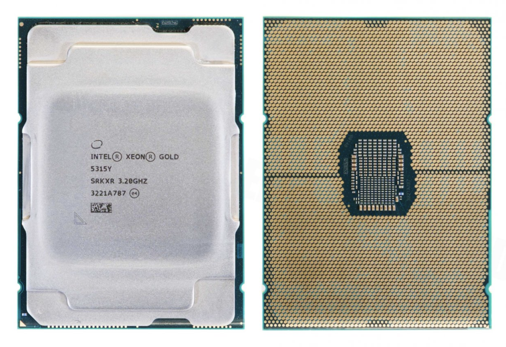

<!--  -->

# Workshop na "Serverování" a hosting

> Co je to server?

Odpověď

Server je počítač, který poskytuje služby jiným počítačům (klientům) v síti.

> Co je to cloud?

Odpověď

Cloud je model poskytování IT služeb přes internet,
který umožňuje uživatelům přístup k výpočetnímu výkonu, úložišti a dalším službám bez nutnosti vlastnit fyzickou infrastrukturu.

Pro domácí a edukační účely lidé staví tzv. "homelab" servery,
které slouží jako testovací prostředí pro různé technologie a služby.

## Úvod

Tento workshop je zaměřen přiblížení znalostí o serverech a hostingu služeb.
Server je počítač, který poskytuje služby jiným počítačům (klientům) v síti.
Server může být fyzický nebo virtuální a může běžet na různých operačních systémech.
Server může poskytovat různé služby, jako je webhosting, databázové služby, e-mailové služby a další.

# HW

## KVM (Keyboard, Video, Mouse)

Serverové základní desky často obsahují specializované sítové porty pro připojení
ke specializoanéme "mini"-počítači, který existuje na základní desce a má možnost
spravovat periferie a další funkce celého serveru.

**IPMI** (Intelligent Platform Management Interface) je standard pro správu serverů,
který umožňuje vzdálenou správu a monitorování serverů.

> Kde se na tomto obrázku nachází KVM subsystém?

> Ukázat IPMI web interface

> Jaký z ethernet portů je určen pro připojení k KVM?

> Jak vypnete ethernet porty na základní desce?

> Proč jsou PCIe sloty 2 a 4 pouze x8?

Serverové procesory

- **Intel** Xeon (socket 3647, 4189)
  - Jader až 144 (Xeon 6766E / 250W TDP)

- **AMD** EPYC (socket SP3, SP5, SP6)
  - Jader až 192 (EPYC Genoa 9965 / 500W TDP)

- **ARM** Ampere
  - Jader až 128 (Ampere Altra Max / 250W TDP)

Nicméně servery většinou nemají pouze jeden socket,
ale **mají jich více**.

# Virtualizace

Virtualizace je metoda pro rozdělení fyzického serveru na více virtuálních serverů,
které mohou běžet na různých operačních systémech a aplikacích.

Virtuální servery jsou izolované od sebe a mohou mít různé konfigurace a nastavení.

Virtualizace umožňuje efektivní využití hardwarových zdrojů a zjednodušuje správu serverů.

Existuje několik typů virtualizace:

- **Hardware virtualizace** - emulace celého hardwaru, včetně CPU, paměti a disků
- **Kontainerizace** - emulace aplikací, které běží na fyzickém serveru

Hardwarovou virtualizaci najdeme v hypervisorech,
například **KVM** (Kernel-based Virtual Machine) nebo **VMware ESXi**.

OS virtualizaci najdeme v operačních systémech,
například **Docker** nebo **LXC**.

> Co je hlavním rozdílem mezi těmito virtualizacemi?

Odpověď

Hlavním rozdílem mezi těmito virtualizacemi je úroveň izolace a emulace.

- **Hardware virtualizace** emuluje celý hardware, včetně CPU, paměti a disků.
  - To znamená, že každý virtuální server má svůj vlastní operační systém a aplikace.
  - Například KVM nebo VMware ESXi.

- **Kontainerizace** emuluje pouze aplikace, které běží na fyzickém serveru.
- To znamená, že všechny kontejnery běží na stejném operačním systému a **sdílejí stejné jádro**.
  - Například Docker nebo LXC.

> Ukázat Proxmox

Proxmox je open-source virtualizační platforma,
používající KVM a LXC pro virtualizaci serverů a kontejnerů.

# RAID (Redundant Array of Independent Disks)

RAID (Redundant Array of Independent Disks) je technologie pro kombinaci více pevných disků do jednoho logického celku.

RAID může zlepšit výkon, dostupnost a spolehlivost dat.

**RAID ale není záloha** dat.

Proč?

Odpověď

RAID chrání před selháním disku,
ale neochrání před ztrátou dat způsobenou lidskou chybou,
viry nebo jinými faktory.

Pokud například smažete soubor na RAID poli,
soubor bude smazán na všech discích v poli
a nebude možné ho obnovit.

Nebo pokud smažete produkční databázi, RAID vám nepomůže při obnově dat.

> Ukázat ZFS RAID

# Backup

Zálohování je proces kopírování dat na jiný disk nebo server,
aby bylo možné je obnovit v případě ztráty nebo poškození dat.

Backup proces může (a často by měl) zahrnovat více úrovní ochrany dat

- používání RAID pro ochranu před selháním disku
- zálohování dat na jiný disk nebo server
- zálohování dat do cloudu/geograficky odděleného místa
- zálohování dat na pásku nebo jiné archivní médium

> Ukázat CIFS Backupy na Proxmoxu

> Ukázat Proxmox Backup Server

## Metoda 3-2-1

Metoda 3-2-1 je doporučený postup pro zálohování dat,
který zahrnuje následující kroky:

1. **3** kopie dat (1 primární a 2 záložní)
2. **2** různé typy médií (např. disk a páska)
3. **1** kopie mimo lokalitu (např. cloud nebo jiná geograficky oddělená lokalita)

# Monitoring

Ukážeme si monitoring serveru pomocí nástrojů:

- **Telegraf** - sbírá data z různých zdrojů a posílá je do databáze
- **InfluxDB** - databáze pro ukládání časových řad
- **Grafana** - vizualizace dat z InfluxDB
- **Graylog** - log management a analýza logů

# Reverse proxy

Reverse proxy je server, který přijímá požadavky od klientů a předává je jinému serveru.

Reverse proxy může být použit pro:

- **Load balancing** - rozdělení zátěže mezi více serverů
- **SSL termination** - dešifrování SSL/TLS provozu
- **Caching** - ukládání často používaných dat pro zrychlení přístupu
- **Security** - ochrana backend serverů před útoky
- **Authentication** - ověřování uživatelů před přístupem k backend serverům
- **Compression** - komprese dat pro snížení velikosti přenášených dat

> Nakreslete diagram deploymentu s reverse proxy.

> Jaký je problém s prací s realnou IP adresou klienta?

> Jaké znáte reverzní proxy?

Odpověď

Některé z nejznámějších reverzních proxy jsou:

- **Nginx** - open-source webový server a reverzní proxy
- **Traefik** - open-source moderní reverzní proxy a load balancer
- **HAProxy** - open-source load balancer a reverzní proxy
- **Caddy** - open-source webový server a reverzní proxy
- **Apache** - open-source webový server a reverzní proxy
- ...

## HTTPS a SSL

HTTPS (Hypertext Transfer Protocol Secure) je protokol pro bezpečnou komunikaci po internetu.
HTTPS používá SSL/TLS (Secure Sockets Layer / Transport Layer Security) pro šifrování dat mezi klientem a serverem.

SSL/TLS certifikát je digitální certifikát, který potvrzuje identitu serveru a šifruje data mezi klientem a serverem.
SSL/TLS certifikát je vydáván certifikační autoritou (CA),
která ověřuje identitu serveru a vydává certifikát.

> Kde získáte SSL/TLS certifikát?

Odpověď

Certifikát můžete získat od certifikační autority (CA)
za poplatek, nebo můžete použít bezplatný certifikát od Let's Encrypt.

Pokud používáte Let's Encrypt, certifikát je platný pouze 90 dní
a je třeba ho pravidelně obnovovat.

## Let's Encrypt

Let's Encrypt je bezplatná certifikační autorita (CA),
která poskytuje SSL/TLS certifikáty pro webové stránky.

Let's Encrypt používá automatizovaný proces pro vydávání a obnovování certifikátů,
který je snadno použitelný a nevyžaduje žádné manuální zásahy.

Integrace a podpora pro Let's Encrypt je dostupná v mnoha webových serverech a aplikacích.

Lets Encrypt používá protokol ACME (Automatic Certificate Management Environment)
pro automatizaci procesu vydávání a obnovování certifikátů.

Podporuje dva způsoby ověření domény:

- **DNS-01** - ověření pomocí DNS záznamu
- **HTTP-01** - ověření pomocí HTTP požadavku

### HTTP-01

Pokud chceme ověřit doménu pomocí HTTP-01,
musíme vytvořit speciální soubor na našem webovém serveru,
který Let's Encrypt použije k ověření domény.

Poté Let's Encrypt provede HTTP požadavek na tento soubor
a v případě úspěšného ověření nám vydá certifikát.

### DNS-01

Pokud chceme ověřit doménu pomocí DNS-01,
musíme vytvořit speciální DNS záznam,
který Let's Encrypt použije k ověření domény.

> DNS-01 je možné použít pro získání tzv. wildcard certifikátu,
> který pokrývá všechny subdomény domény.
> 
> Například certifikát pro `*.delta-topgun.cz`

## SSL/TLS termination

Reverzní proxy většinou zpracovávají HTTPS požadavky od klientů,
ale k serverům komunikují pomocí HTTP.

Tímto se zjednodušuje správa certifikátů a šifrování,
a také se zvyšuje výkon serverů, protože šifrování a dešifrování je náročné na výkon.

Servery poté vystavují například pouze HTTP port **80** nebo **3000** a reverzní proxy tyto porty
vystavuje pod specifickými doménovými nazvy na internet pod portem **443**.

<!--  -->
